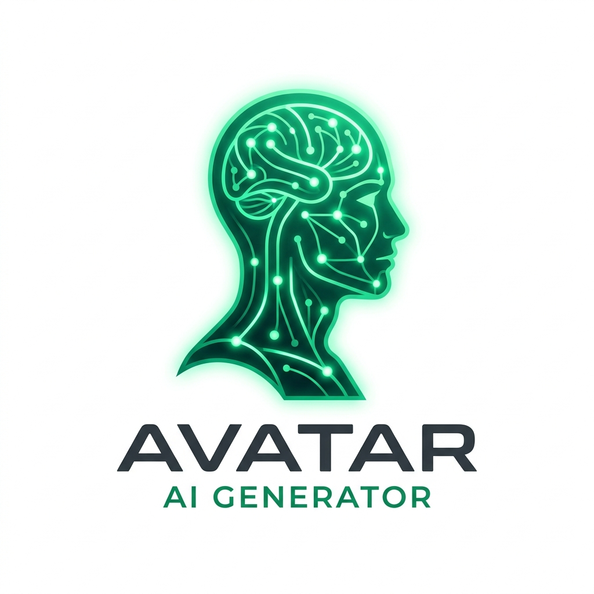

# AIVatar - Premium AI Avatar Generator



AIVatar is a high-end, single-page web application designed to generate unique digital avatars using advanced AI. Built with security, privacy, and aesthetic excellence in mind, AIVatar offers a seamless experience for creating your digital soul.

## ✨ Features

- **Premium UI/UX:** A stunning, responsive design featuring glassmorphism, dynamic background gradients, and smooth Framer Motion animations.
- **Privacy Focused:**
  - **Server-Side Proxying:** All external API calls are handled on the server, hiding the source URLs and sensitive integration details from the browser's Network tab.
  - **Payload Obfuscation:** Prompt data is Base64 encoded before transmission to prevent casual inspection.
  - **Binary Streaming:** Images are streamed directly as binary blobs, ensuring the original external image URL never reaches the client.
- **Mobile Friendly:** Fully responsive layout that adapts gracefully from large desktop monitors to mobile screens.
- **Instant Actions:** One-click download with clean naming (`ai-image-YYYY-MM-DD_HH-mm.png`) and quick "Generate Another" functionality.
- **Prompt Suggestions:** Quick-action buttons for common styles like "3D Cartoon", "Neon Cyberpunk", and more.

## 🚀 Tech Stack

- **Framework:** [Next.js 15 (App Router)](https://nextjs.org/)
- **Styling:** [Tailwind CSS 4](https://tailwindcss.com/)
- **Animations:** [Framer Motion](https://www.framer.com/motion/)
- **Icons:** [Lucide React](https://lucide.dev/)
- **Components:** [Radix UI](https://www.radix-ui.com/) (Shadcn UI)
- **API Handling:** [Axios](https://axios-http.com/)
- **State & Feedback:** [Sonner](https://sonner.stevenly.cc/) (Toasts)

## 🛠️ Getting Started

### Prerequisites

- Node.js 18.x or later
- npm or yarn

### Installation

1.  **Clone the repository:**

    ```bash
    git clone https://github.com/RashedulHaqueRasel1/ai-image-generate.git
    cd ai-image-generate
    ```

2.  **Install dependencies:**

    ```bash
    npm install
    ```

3.  **Set up environment variables:**
    Create a `.env.local` file in the root directory and add your API URL:

    ```env
    NEXT_PUBLIC_API_URL=***
    ```

4.  **Run the development server:**

    ```bash
    npm run dev
    ```

5.  **Open the app:**
    Navigate to [http://localhost:3000](http://localhost:3000) in your browser.

## 🔒 Security Architecture

AIVatar implements a robust security layer between the user and the external AI engine:

1.  **Client:** Encodes the prompt and sends a `POST` request to the internal `/api/generate` route.
2.  **Server:** Decodes the prompt, fetches the image URL from the external API, and then fetches the actual image data.
3.  **Response:** The server streams the raw binary image data back to the client as a blob, keeping all external URLs completely hidden from the browser's network logs.

## 🔗 Links

- **Live Demo:** [https://ai-image-generate-v1.vercel.app/](https://ai-image-generate-v1.vercel.app/)
- **Repository:** [https://github.com/RashedulHaqueRasel1/ai-image-generate](https://github.com/RashedulHaqueRasel1/ai-image-generate)

## 📄 License

This project is licensed under the MIT License - see the [LICENSE](LICENSE) file for details.

---

## 🧑‍💻 Author

**Rashedul Haque Rasel**

Built with ❤️ using Next.js, TypeScript, and Tailwind CSS.

- **Email:** [rashedulhaquerasel1@gmail.com](mailto:rashedulhaquerasel1@gmail.com)
- **Portfolio:** [https://rashedul-haque-rasel.vercel.app/](https://rashedul-haque-rasel.vercel.app/)
